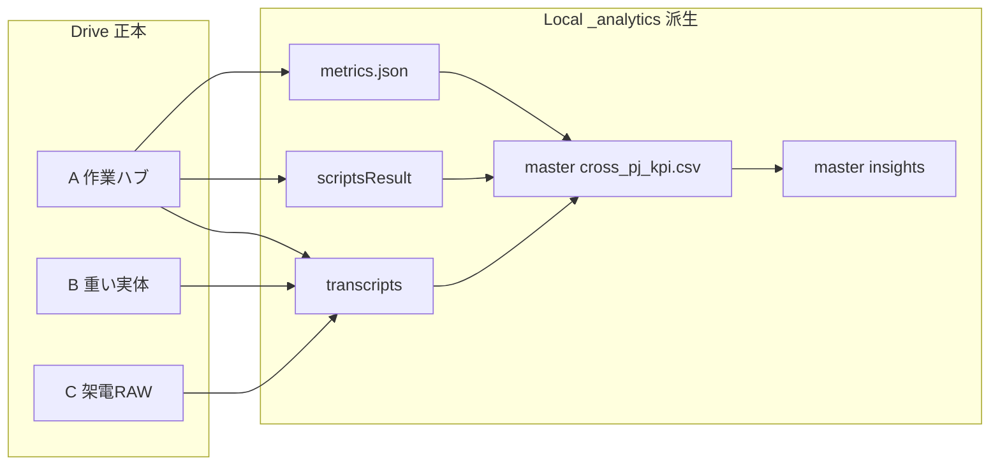

# RE 設計書: Drive 3 本構成 + ローカル `_analytics/` 解析倉庫（2026-05）

このリポジトリ（`salse_consulting`）の **データ置き場・解析レイヤー**を、1000PJ 規模でも崩れない形に組み替えるための設計書です。

実改造はこの設計書合意 **後に一括実行**します（このドキュメント自体には実装は伴いません）。

## 1. 目的

- **Drive 3 本構成**で「重い実体」「人＋AI の作業ハブ」「架電 RAW」を物理的に分けて、同期・容量・列挙の重さを別レイヤーに切り出す。
- **ローカル限定の `_analytics/`** で、PJ 横串の KPI（数値）と AI 解析（MD）を成立させる。Drive へは載せない（派生物のため）。
- 人もエージェント（AI）も **入口名だけ知っていれば迷わない**ディレクトリ名規約に揃える。

## 2. なぜこの形か（要点だけ）

### 2.1 1000PJ 想定で重くなる 3 要因

PJ が増えたとき、体感の悪化はこの順で来ます。

1. **Drive 同期の総量**: 録音/動画/PDF が PJ ごとに増えると、Drive for Desktop の初期同期と容量が膨らむ
2. **同階層フラットなフォルダ列挙**: 1 階層に 1000 サブフォルダがあると Explorer / WSL `ls` が遅くなる
3. **Cursor のインデックス**: 重いツリーを Cursor が読むと編集体感が落ちる

### 2.2 対策の対応関係

| 重さの源 | 対策 |
|----------|------|
| 1. 同期総量 | **Y 案（重い実体 B を分離）** で、A と B の同期負荷を独立させる |
| 2. フラット列挙 | **年シャード**（`2026/`, `2027/` …）で各年あたりに分散する |
| 3. Cursor 圧 | `_analytics/` を **Git 対象外**かつ Cursor 側でも軽く扱う（必要なら `.cursorignore` で限定） |

## 3. 用語

- **Drive 3 本（A / B / C）**: それぞれ別々の Google Drive フォルダ ID。役割で分ける。
- **`_analytics/`**: ローカルだけに置く解析倉庫。**派生物**なので消しても再生成可能。
- **入口MD**: PJ ごとに置く `transcripts/scripts/notes/*.md`。frontmatter に集計対象の数値を持つ。
- **派生物**: 元データから機械的に作り直せる出力物（CSV／集計／レポート）。

## 4. 最終形（テキストアートと役割表）

```
salse_consulting/
├── salesHUB/                          架電/PJ アプリ
├── nextcrm-app/                       CRM/Consulting
├── docs/                              運用ドキュメント
├── scripts/                           同期/解析/リンク貼り
│
├── project_hangarr  -> A (Drive)      人+AI の作業ハブ（軽量raw・作成物）
│   └── 2026/PJname_yyyymmdd/
│       ├── pj_sheet/   (CSV export)
│       ├── meta/       (README/ADR)
│       └── generated/  (HTML/CSS下書き、AI生成MD)
├── PJ_asset_Data    -> B (Drive)      重い実体
│   └── 2026/PJname_yyyymmdd/
│       ├── materials/  (PDF/PPTX)
│       ├── call_voice/ (録音)
│       ├── videos/
│       └── client_doc/
├── call_rec         -> C (Drive)      架電RAW（録音・リスト・export）
│
└── _analytics/                        ローカル限定（Git 対象外）
    ├── by-pj/2026/PJname_yyyymmdd/
    │   ├── metrics.json               月次KPI（pj_sheet 由来）
    │   ├── transcripts/*.md           Zoom自動文字起こし（差分DL）
    │   ├── scripts/*.md               使ったトークスクリプト×成果
    │   └── notes/*.md                 人の手書きメモ
    ├── master/
    │   ├── cross_pj_kpi.csv           全PJ縦積み
    │   ├── kpi_by_month.csv           月次集計
    │   └── insights/*.md              横串レポート（AI/人）
    └── manifest/catalog.csv           なに・どこに・いつ更新
```

| 入口名 | 種別 | 役割 | Git | 同期方法 |
|--------|------|------|-----|----------|
| `project_hangarr` | Drive A シンボリックリンク | 軽量 raw（CSV export）と作成物（HTML/CSS/MD）の作業ハブ | 対象外 | `scripts/sync_drive_full.py`（A 用ラッパー） |
| `PJ_asset_Data` | Drive B シンボリックリンク | 重い実体（PDF/PPTX/録音/動画） | 対象外 | `scripts/run_sync_pj_asset_data.sh` |
| `call_rec` | Drive C シンボリックリンク | 架電 RAW（録音・リスト・export） | 対象外 | `scripts/run_sync_call_raw.sh` |
| `_analytics/` | ローカル派生物 | PJ 横串の KPI と AI 解析の倉庫 | 対象外 | `scripts/build_master_kpi.py`（再生成） |

## 5. データフロー



- **入力**: Drive A の `pj_sheet/*.csv`（Sheets export）、Drive A の Zoom 自動文字起こし（毎朝06:00 差分DL）
- **出力**: `_analytics/master/cross_pj_kpi.csv` / `kpi_by_month.csv` / `insights/*.md`

## 6. 命名規約

- **PJ スラッグ**: `PJname_yyyymmdd`（半角英数とアンダースコアのみ。日付は開始日 8 桁）
- **年シャード**: `2026/`, `2027/` …（`PJ_asset_Data` と `project_hangarr` の **両方**で同じ規約）
- **`_analytics/` の構造**は `by-pj/<year>/<slug>/...` に **必ず**揃える（パス一致が横串の前提）
- **ファイル名**は `lowercase_snake_case`、日付は `yyyymmdd` または `yyyy-mm-dd`（混在禁止。1ディレクトリで揃える）

## 7. 受け入れ基準（合意条件）

- 上記 4 項（最終形・役割表・データフロー・命名規約）に **既存 docs と矛盾がない**
- `docs/_analytics-spec.md` が同時に整備され、`metrics.json` / MD frontmatter の **キーが固定**されている
- `docs/voice-pipeline.md` が、Zoom 自動文字起こしの取り込み順と **失敗時の再試行**を明記している

## 8. ロールバック

- リポジトリ直下のシンボリックリンク（`project_hangarr` / `PJ_asset_Data` / `call_rec`）は **物理データではない**ため、張替えで戻せる
- `_analytics/` は **派生物**なので、まるごと削除して `scripts/build_master_kpi.py` を再実行すれば復元
- Drive 上のフォルダ ID は変更しない（移行期は **新旧2つを併記**して導線だけ切替）

## 9. 次フェーズ（合意後に一発で流す範囲）

- `.gitignore` に `_analytics/` を追加
- `project_hangarr` のリンク先を **A=`1-ojsPDPdIZz6gelUBc5IhjIPvy9gllQq`** に張替え
- `PJ_asset_Data` のリンク先を **B=`144hJUwro1nQ-vRTwQ8yXV1mZs2Wfbsc2`** に張替え
- 同期スクリプトを A/B/C で分離（A 用 `scripts/run_sync_project_hangarr.sh` 追加）
- 解析雛形 `scripts/build_master_kpi.py` と `scripts/fetch_zoom_transcripts.py` の空雛形を追加
- `old/` などの整理は **その次のフェーズ**で別途

## 10. 参照

- [docs/storage-coexistence.md](./storage-coexistence.md) — Drive 3 本と `_analytics/` の役割（同期/二重保管回避）
- [docs/drive-data-hub.md](./drive-data-hub.md) — A/B/C の Folder ID と同期コマンド
- [docs/_analytics-spec.md](./_analytics-spec.md) — `metrics.json` と MD frontmatter のスキーマ
- [docs/voice-pipeline.md](./voice-pipeline.md) — Zoom 自動文字起こし + 毎朝06:00 差分巡回
- [docs/db-drive-policy.md](./db-drive-policy.md) — DB / Drive / Local（_analytics）の三層方針
- [docs/project-hangarr.md](./project-hangarr.md) — `project_hangarr` の標準ツリーと Drive 同調
