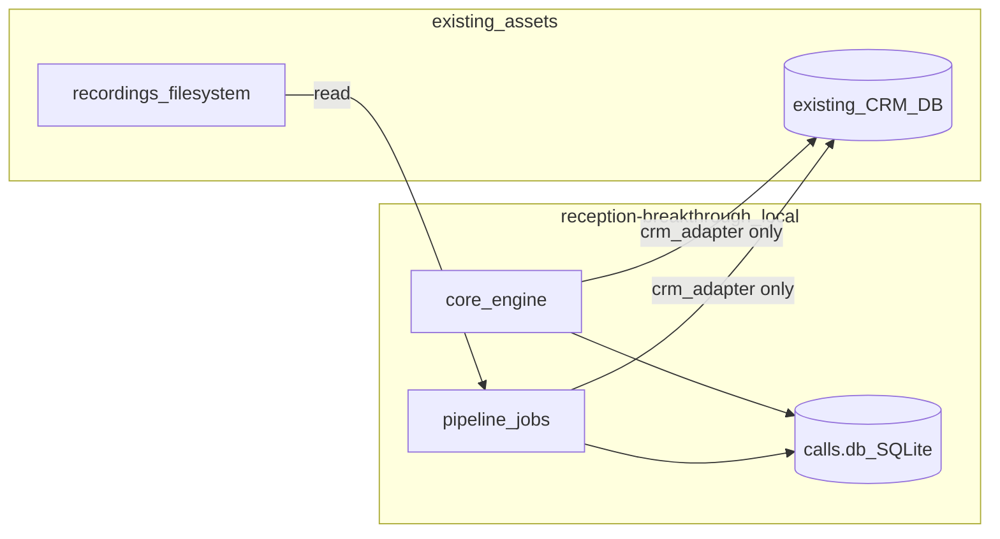
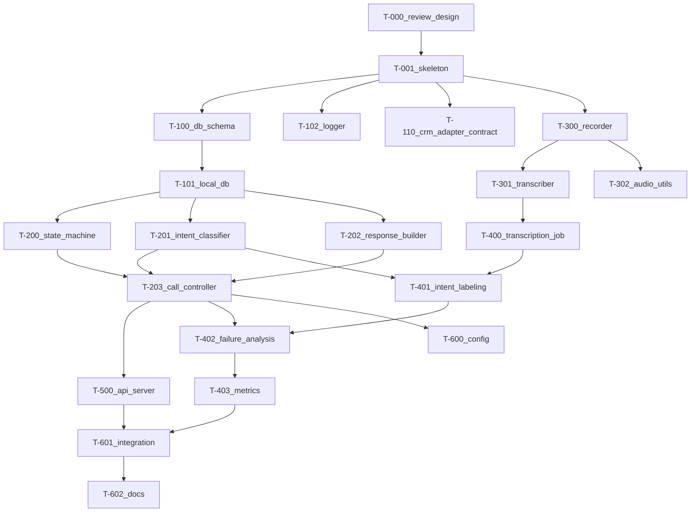

# 実装バックログ & データ境界仕様書

| version | date | change |
| --- | --- | --- |
| 1.0 | 2026-05-04 | 初版（データ境界・`crm_adapter` 契約・依存順タスク分解・DoD） |

> 参照: state_id / intent_id は [README.md §2](./README.md#2-共通-id-体系cross-reference-keys) を正本とする。
> 関連: 遷移表は [state-machine-spec.md](./state-machine-spec.md)、intent ルールは [intent-improvement-spec.md](./intent-improvement-spec.md)。

---

## 1. 全体方針

- **このリポジトリ root 直下に `reception-breakthrough/` を新設** する前提（[README.md §1](./README.md)）
- 実装は **設計書を 1 件ずつ消化する形** で進める。設計書を修正したら必ず本バックログの対応タスクも更新する
- **無料スタック前提**: Python 3.10+ / SQLite / `whisper.cpp` / 任意で Ollama。電話 API（Twilio 等）は使わない
- 1 タスク = 0.5〜1 日。これを超えそうなら分割

> 用語: **DoD (Definition of Done)** = タスクの「完了条件」。これを満たさない限りタスクは閉じない。

---

## 2. データ境界ルール

このモジュールは **2 種類の DB** に触る。それぞれの責務を厳格に分ける。



### 2.1 専用 DB（`calls.db`）が **持つ** もの

改善ループの素材。本モジュールが排他的に書き込み・読み込みする。

| テーブル | 役割 |
| --- | --- |
| `call_sessions` | 通話セッション（mode, lead_id, start_time, end_time, outcome） |
| `call_recordings` | 録音ファイルの参照（path, duration, hash） |
| `transcripts` | 文字起こし（speaker, text, start_time, end_time） |
| `intent_labels` | 自動 + 人手の intent ラベル（[intent-improvement-spec.md §5.2](./intent-improvement-spec.md#52-修正の記録)） |
| `state_transitions` | 遷移ログ（[state-machine-spec.md §7](./state-machine-spec.md#7-ログ要件state_transitions-テーブル)） |
| `outcomes` | 最終結果と理由 |
| `failure_cases` | 失敗箇所のスナップショット（pipeline で生成） |
| `template_variants` | テンプレ ID とバリエーションの対応・採用状態 |
| `metric_snapshots` | 日次集計値（接続率、intent 別精度等） |

### 2.2 専用 DB が **持たない** もの

| 項目 | 置き場所 |
| --- | --- |
| 会社マスタ・連絡先マスタ | 既存 CRM |
| 商談履歴・受注情報 | 既存 CRM |
| ユーザーアカウント・権限 | 既存 CRM（または別認証基盤） |
| 個人情報（氏名フルネーム） | 保存しない（マスキングして transcripts に残す） |

### 2.3 既存 CRM へのアクセスルール

1. **直接 SQL を書かない** — 必ず `crm_adapter` を経由
2. **書き込みは結果のみ** — `update_call_result` のみが書き込みエントリポイント
3. **読み込みは必要最小限** — 架電対象の取得時に必要なフィールドだけ
4. **adapter は同期 API** で実装する（複雑なキューや非同期は避ける）
5. **adapter のテストはモック必須** — 既存 CRM への接続は CI で実行しない

---

## 3. `crm_adapter` 契約（インターフェース仕様）

`reception-breakthrough/infra/external/crm_adapter.py` の **公開メソッド** はこの契約で固定する。実装言語が変わっても契約は変えない。

### 3.1 ドメイン型

```python
# 例示用（実装は型ヒントで書く）
LeadId = str
PhoneNumber = str

class LeadTarget:
    id: LeadId
    company_name: str
    phone: PhoneNumber
    industry: str | None
    last_called_at: datetime | None
    next_call_at: datetime | None
    status: str  # CRM 側の文字列をそのまま受ける

class CallResult:
    session_id: str
    lead_id: LeadId
    outcome_id: str           # OUT_CONNECTED / OUT_REJECTED / OUT_ABSENT / OUT_NOISE
    final_state_id: str       # state_id
    rejection_reason: str | None
    callback_at: datetime | None
    started_at: datetime
    ended_at: datetime
    mode: str                 # AI / HUMAN
```

### 3.2 メソッド契約

| メソッド | 入力 | 出力 | 例外 |
| --- | --- | --- | --- |
| `fetch_call_targets(limit, filters)` | 件数上限、業種・地域等のフィルタ dict | `list[LeadTarget]` | `CRMConnectionError` |
| `update_call_result(result)` | `CallResult` | `bool`（書き込み成否） | `CRMConnectionError`, `LeadNotFoundError` |
| `mark_lead_locked(lead_id, locked_by)` | リード ID、ロック保持者 | `bool` | `LeadAlreadyLockedError` |
| `release_lead_lock(lead_id, locked_by)` | リード ID、ロック保持者 | `None` | `LeadNotFoundError` |

### 3.3 実装ルール

- アダプタは **トランザクション境界を持つ** — `update_call_result` は単一トランザクションで完結
- **冪等性** — 同じ `session_id` で 2 回呼ばれても CRM 側に重複行を作らない
- **タイムアウト** — 既存 CRM 接続のタイムアウトは 5 秒。超過時は例外
- **接続文字列** — 環境変数経由（コードに直書き禁止）

> 用語: **冪等 (idempotent)** = 何回叩いても結果が同じ性質。再実行しても壊れない。

---

## 4. ディレクトリ構成（実装側）

設計書側は `docs/reception-breakthrough/` に固定。実装は下記をそのまま採用する。

```
reception-breakthrough/
├── app/
│   ├── main.py
│   ├── config.py
│   └── scheduler.py
├── core/
│   ├── state_machine.py
│   ├── intent_classifier.py
│   ├── response_builder.py
│   └── call_controller.py
├── voice/
│   ├── recorder.py
│   ├── transcriber.py
│   ├── tts.py
│   └── audio_utils.py
├── infra/
│   ├── db/
│   │   ├── local_db.py
│   │   ├── models.py
│   │   └── migrations.sql
│   ├── external/
│   │   ├── crm_adapter.py
│   │   └── telephony_port.py    # 将来差し替え用のポート定義のみ
│   └── logging/
│       └── logger.py
├── pipeline/
│   ├── transcription_job.py
│   ├── intent_labeling.py
│   ├── failure_analysis.py
│   └── metrics.py
├── ui/
│   ├── api_server.py            # FastAPI（後フェーズ）
│   └── mock/
├── data/
│   ├── recordings/
│   ├── transcripts/
│   └── exports/
├── tests/
├── requirements.txt
└── README.md
```

---

## 5. タスク分解（依存順）

各タスクは **DoD と検証観点** つき。上から順に着手する。並行可能なものは「並行可」と注記。

### Phase 0 — 設計書とリポジトリ準備

#### T-000: 設計書 3 点のレビュー完了

- 内容: 本ディレクトリ配下 3 ファイルを通読し、ID の不整合がないか確認
- DoD:
  - state_id, intent_id, outcome_id, response_template_id がどの文書でも同じ綴り
  - 不変条件（[README.md §3](./README.md#3-設計上の不変条件必読)）に矛盾するタスクが本ファイルにない
- 検証: 3 ファイルから ID を grep で抽出し、表記ゆれがないこと

#### T-001: モジュール雛形作成

- 内容: 上記 §4 のディレクトリと空ファイルを作成。`requirements.txt` と `README.md` のスタブも置く
- DoD:
  - 全ディレクトリ + `__init__.py` 作成済み
  - `requirements.txt` に最低限（`pytest`, `sqlite-utils` 等）
  - `python -m pytest` が 0 件 PASS で通る
- 検証: `tree reception-breakthrough/` の出力が §4 と一致

---

### Phase 1 — 基盤（DB + ロガー + アダプタ契約）

#### T-100: 専用 DB スキーマ定義（`infra/db/migrations.sql`）

- 内容: §2.1 の全テーブルを CREATE 文で記述。`README.md §2` の ID は CHECK 制約で縛る
- DoD:
  - `state_id IN ('S0','S1',...,'S11')` の CHECK 制約あり
  - `outcome_id IN ('OUT_CONNECTED', ...)` の CHECK 制約あり
  - `intent_id` は型のみ TEXT（増減頻度が高いので CHECK しない）
  - `sqlite3 calls.db < migrations.sql` でエラーなく作成できる
- 検証: 制約違反データを INSERT してエラーになることを確認

#### T-101: `local_db.py` 接続層

- 内容: SQLite への接続・トランザクション・migration 適用関数
- DoD:
  - 接続関数が context manager 対応
  - migration 未適用時は自動適用、再実行時は冪等
- 検証: ユニットテスト（一時ファイル DB で migration → 再実行 → 同一 schema）

#### T-102: `logger.py`

- 内容: 構造化ログ（JSON Lines）出力。session_id を MDC で持つ
- DoD:
  - レベル `DEBUG/INFO/WARN/ERROR` 切替可能
  - `WARN: undefined_transition` 等のキーで grep しやすい形式
- 検証: 想定エントリの正規表現マッチで PASS

#### T-110: `crm_adapter.py` の **インターフェース** 実装（並行可: T-100 と）

- 内容: §3 のメソッドシグネチャと例外クラスをまず空実装で揃える。`InMemoryCRMAdapter`（モック）を tests に置く
- DoD:
  - メソッド全部の型ヒント完全
  - モックでテストが PASS（fetch → update のラウンドトリップ）
- 検証: `pytest tests/test_crm_adapter_contract.py` が PASS

---

### Phase 2 — コアエンジン（state machine + intent + response）

#### T-200: `state_machine.py`（[state-machine-spec.md §4-§6](./state-machine-spec.md)）

- 内容: 遷移表をデータとして持ち、`next_state(current, input) -> Transition` を実装
- DoD:
  - 遷移表は **コードではなく辞書 / YAML** で定義（増減しやすく）
  - 未定義の (state, input) は `F1_unclear` 扱い + WARN ログ
  - `S11` から先への遷移は禁止（例外）
  - state ごとの timeout 値を保持
- 検証:
  - 全遷移表のセル数だけテストケース（テーブル駆動テスト）
  - 例外遷移（`F*`, `EV_TIMEOUT`, `EV_HANGUP`）の各 1 ケース
  - `unclear_count >= 3` で `S11` に行くこと

#### T-201: `intent_classifier.py` ルールベース版（[intent-improvement-spec.md §2-§4](./intent-improvement-spec.md)）

- 内容: §4 の C2 判定 3 段（テキスト / 文型 / 音声）。最初は LLM なし、ルールのみ
- DoD:
  - キーワード辞書は **YAML 設定ファイル化**（実装直書き禁止）
  - C1 と C2 の衝突解決ルール（§4.4）を実装
  - confidence を返す（< 0.6 で `F1_unclear` 扱い）
- 検証:
  - §2.1 の各 intent の例をテストケース化
  - C2 の境界ケース（疑問符あり「結構ですか？」など）の判定

#### T-202: `response_builder.py`

- 内容: `(state, intent, variant_seed) -> response_text` の生成。テンプレ ID から本文を引き、語尾ローテーションを適用
- DoD:
  - テンプレ辞書は YAML（[intent-improvement-spec.md §3](./intent-improvement-spec.md#3-返答テンプレ-id-一覧) と完全一致）
  - 語尾ローテーション（§3.1）を `template_variant_id` 付きで返す
  - 必ず行動要求で終わるバリデーション（疑問形 / 依頼形でないテンプレを reject）
- 検証:
  - 全テンプレ ID で 1 回ずつ生成して assertion
  - バリエーションが session 単位でランダム（同一 session 内では固定）

#### T-203: `call_controller.py`（オーケストレーター）

- 内容: T-200/201/202 を束ね、1 セッションを最初から最後まで進める
- DoD:
  - 入力: lead_id + 入力ストリーム（intent / event）
  - 出力: 各遷移を `state_transitions` に書き込み、最後に `outcomes` を書く
  - mode (`AI` / `HUMAN`) を引数で受ける（同じパス）
- 検証:
  - シナリオテスト: A1→D3→S6→S7→S8 で `OUT_CONNECTED`
  - シナリオテスト: B1→C2→S5→C2→S11 で `OUT_REJECTED`
  - シナリオテスト: E1→E3→S10 で `OUT_ABSENT`

---

### Phase 3 — 音声パイプライン（最低限）

#### T-300: `recorder.py`（人力モード対応）

- 内容: 既存の音声ファイル投入と、人力架電時のローカル録音保存
- DoD:
  - WAV 16kHz mono に正規化
  - `call_recordings` に行追加
- 検証: サンプル音声を投入して 1 行追加されること

#### T-301: `transcriber.py`（whisper.cpp ラッパ）

- 内容: 録音 → テキスト + タイムスタンプ
- DoD:
  - 話者分離は **AI / 受付の二択**（自分の発話時間帯は既知なので差分で簡易判定）
  - `transcripts` に行追加
  - `--small` モデルでローカル動作（追加課金ゼロ）
- 検証: 既知サンプルでテキストが期待文字列を含むこと

#### T-302: `audio_utils.py`

- 内容: 音量しきい値・無音検出（silence_ms 計測用）
- DoD:
  - `EV_TIMEOUT` 検出に使える静音検出関数
- 検証: 単純な無音 wav と発話 wav で結果が逆転すること

---

### Phase 4 — 改善ループ（pipeline）

#### T-400: `transcription_job.py`

- 内容: 未処理の録音を順番に T-301 へ渡し、結果を保存
- DoD:
  - 冪等（同じ recording を再実行しても DB が壊れない）
  - 失敗時の retry 上限とログ
- 検証: 重複実行で `transcripts` の行数が変わらない

#### T-401: `intent_labeling.py`

- 内容: 未ラベルの transcript に対して T-201 を流し、`intent_labels` に書く
- DoD:
  - `predicted_intent` + `confidence` を必ず保存
  - `correct_intent` 列はそのまま NULL
- 検証: 既知 transcript で intent が期待通りに付くこと

#### T-402: `failure_analysis.py`

- 内容: `OUT_REJECTED` `OUT_NOISE` の最後の遷移を抽出し `failure_cases` に格納
- DoD:
  - state × last_input ごとの集計表を CSV 出力
  - レビュー優先キュー（[intent-improvement-spec.md §5.1](./intent-improvement-spec.md#51-再ラベル対象の選び方)）の順序で出る
- 検証: モックデータで失敗パターン上位 5 件が抽出されること

#### T-403: `metrics.py`

- 内容: §[intent-improvement-spec.md §6.3](./intent-improvement-spec.md#63-評価指標) の指標を日次スナップショット化
- DoD:
  - `metric_snapshots` に日次行が増える
  - CSV エクスポート機能あり
- 検証: 同一データで 2 回実行しても 1 行のみ（冪等）

---

### Phase 5 — UI（後フェーズ・最低限）

#### T-500: `ui/api_server.py`（FastAPI）

- 内容: 自己架電画面用の REST。GET セッション情報、POST 遷移トリガー（HUMAN 用）
- DoD:
  - エンドポイント `/sessions`, `/sessions/{id}/transitions`, `/leads/next`
  - OpenAPI スキーマが自動生成される
- 検証: `pytest tests/test_api.py` で各エンドポイント PASS

> UI 本体（React 等）は本モジュール外。[ui/mock/](#) にワイヤフレーム MD を置くだけにする。

---

### Phase 6 — ハードニング

#### T-600: 設定の外出し

- 内容: タイムアウト、しきい値、テンプレ辞書、キーワード辞書をすべて YAML 化
- DoD: コードから「マジックナンバー」が消える
- 検証: 設定を変えて挙動が変わるテスト

#### T-601: 統合シナリオテスト

- 内容: 録音ファイル投入 → STT → 自動ラベル → state machine 再生 → outcome 確定までを 1 本で
- DoD: サンプル 3 本（接続成功 / 拒否 / 不在）が想定 outcome に到達
- 検証: CI で実行できる時間（数十秒以内）

#### T-602: ドキュメント整備

- 内容: 実装側 `reception-breakthrough/README.md` に設計書へのリンクと起動手順
- DoD: 新規メンバーが README だけでローカル起動できる

---

## 6. マイルストーン

| マイルストーン | 完了タスク | ゴール |
| --- | --- | --- |
| M1: 設計確定 | T-000 | 3 設計書 + 本バックログがレビュー済み |
| M2: 基盤稼働 | T-100〜T-110 | 専用 DB が立ち、CRM アダプタモックでデータが流れる |
| M3: コア通過 | T-200〜T-203 | シナリオ 3 本（接続 / 拒否 / 不在）が CLI で再生可能 |
| M4: 音声 + 改善ループ | T-300〜T-403 | 録音から自動ラベル + 失敗抽出までが回る |
| M5: UI 接続 | T-500 | 人力架電画面と API が接続 |
| M6: 運用準備 | T-600〜T-602 | 統合テスト PASS、設定外出し完了 |

---

## 7. 依存関係グラフ



---

## 8. 検収観点（モジュール全体）

実装が「使える」と言えるラインを下記で固定する。

1. **シナリオ 3 本**（接続成功 / 拒否 / 不在）が CLI で再現でき、`outcomes` に正しい `outcome_id` が書かれる
2. **C2 曖昧拒否** のサンプル 10 件中 8 件以上が `C2_soft_reject` に分類される
3. **state_transitions** に未定義遷移ログ（`WARN: undefined_transition`）が 0 件
4. **`crm_adapter`** をモックから本番接続に差し替えても、コアコードの変更が不要
5. **改善ループ** の 1 サイクル（録音 → 文字起こし → 自動ラベル → 失敗抽出 → CSV）が手動コマンドで完走する
6. **追加課金ゼロ** — Twilio / OpenAI API / Claude API への依存が `requirements.txt` に入っていない

---

## 9. 進め方の注意（学習者向け）

- 1 タスクずつ、DoD を満たしてから次へ進める。**先回りしてコードを増やさない**
- 各タスクで困ったら、まず該当する設計書セクションへの **リンクをコミットメッセージに書く**（後で追えるように）
- 仕様変更は **設計書を先に直す → 本バックログを更新 → 実装** の順
- ローカル DB のスキーマ変更は **必ず migration ファイル追加**（既存 DB の破壊禁止）

> 用語: **マイグレーション (migration)** = DB のスキーマ（表の構造）を、履歴を残しながら段階的に変更していく仕組み。直接 ALTER せず、変更を 1 ファイルずつ追加して再現性を確保する。
