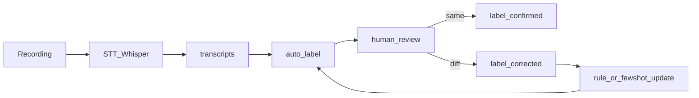

# Intent 分類・改善仕様書

| version | date | change |
| --- | --- | --- |
| 1.0 | 2026-05-04 | 初版（L1/L2 体系、C2 判定ルール、誤分類修正フロー、改善ループ） |

> 参照: ID は [README.md §2.2](./README.md#22-intent_id受付発話の意味ラベル) を正本とする。
> 関連: 遷移表は [state-machine-spec.md §4](./state-machine-spec.md#4-遷移表正常系)、実装タスクは [implementation-backlog.md](./implementation-backlog.md)。

---

## 1. 目的とスコープ

- 受付発話 1 ターンを **1 個の `intent_id`** に変換するルールを定義する
- 日本語特有の **やんわり拒否（C2）** を明文化し、AI が「チャンス」と誤認しないようにする
- 誤分類が出た時の **再ラベリング・テンプレ改善** のループを設計する
- ML モデルの選定や学習パラメータは対象外（採用するモデルが変わってもこの仕様は変わらない）

> 用語: **intent** = 「受付の発話が、行動として何を指しているか」のラベル。文意ではなく **次に何が起きるか** で切る。

---

## 2. 分類体系（L1 / L2）

L1 は state machine の遷移先決定、L2 はテンプレ選択と改善分析に使う。

| L1 | 名前 | 意味 | 主な next_state |
| --- | --- | --- | --- |
| A | listening | 会話継続の余地あり | `S3` `S6` |
| B | purpose_inquiry | 用件確認 | `S3` |
| C | reject | 拒否 | `S4` |
| D | transfer_action | 取次に向けた動き | `S6` `S7` |
| E | absence | 不在・時間 | `S9` |
| F | noise | 不明・聞き取れない | (現状維持) |

### 2.1 各 intent の定義（L2）

#### A 系 — 会話継続

| intent_id | 受付発話の例 | 判定キー | next_state |
| --- | --- | --- | --- |
| `A1_listening` | 「はい」「どういったご用件でしょうか」「少々お待ちください（質問なし）」 | 短い肯定 / 受け身 | `S3` |

#### B 系 — 用件確認

| intent_id | 受付発話の例 | 判定キー | next_state |
| --- | --- | --- | --- |
| `B1_simple_purpose` | 「ご用件は？」「どのようなご用件でしょうか」 | 1 文・短い質問 | `S3` |
| `B2_detailed_purpose` | 「具体的には何の件ですか？」「どの部署宛ですか？」 | 詳細要求・限定要求 | `S3` |

#### C 系 — 拒否

| intent_id | 受付発話の例 | 判定キー | next_state |
| --- | --- | --- | --- |
| `C1_hard_reject` | 「営業はお断りしています」「結構です」「必要ありません」 | 明確な否定語 | `S4` |
| `C2_soft_reject` | 「間に合っております」「大丈夫です」「今は必要ないです」 | 婉曲・回避 | `S4` |
| `C3_policy_block` | 「そういったお電話はお繋ぎしていません」「ご案内は受けておりません」 | 受付ルール表明 | `S4` |

#### D 系 — 取次

| intent_id | 受付発話の例 | 判定キー | next_state |
| --- | --- | --- | --- |
| `D1_hold` | 「少々お待ちください」 | 保留意思 | `S7` |
| `D2_internal_check` | 「確認します」 | 内部確認 | `S7` |
| `D3_name_request` | 「どちら様ですか？」「お名前は？」 | 自分側の情報要求 | `S6` |

#### E 系 — 不在・時間

| intent_id | 受付発話の例 | 判定キー | next_state |
| --- | --- | --- | --- |
| `E1_absent` | 「席を外しています」「本日不在です」 | 不在 | `S9` |
| `E2_busy` | 「今対応できません」 | 多忙 | `S9` |
| `E3_schedule` | 「何時頃なら」「明日の午後なら」 | 時刻提案 | `S10` |

#### F 系 — ノイズ

| intent_id | 受付発話の例 | 判定キー | 扱い |
| --- | --- | --- | --- |
| `F1_unclear` | 文字起こし confidence 低 / 文意不明 | confidence < 閾値 | 同 state 維持 |
| `F2_silence` | 無音 | 音量 < 閾値が継続 | 同 state 維持 |
| `F3_disconnect` | 切断 | 回線イベント | `S11` |

---

## 3. 返答テンプレ ID 一覧

[state-machine-spec.md §4](./state-machine-spec.md#4-遷移表正常系) から参照される `response_template_id` の中身。実装側は ID → 文字列辞書として持つ。

| template_id | 主用途 | テンプレ（雛形） |
| --- | --- | --- |
| `RT_ASK_TRANSFER_SHORT` | A1 直後 | 「ありがとうございます、採用の件で一点だけ確認でして、ご担当の方にお繋ぎいただけますか」 |
| `RT_PURPOSE_SHORT` | B1 | 「採用の件で、現状の確認だけでして、ご担当の方に一度お繋ぎいただけますか」 |
| `RT_PURPOSE_DETAILED` | B2 | 「採用のチャネルの使い分けについて、現状だけ一度お伺いできればと思ってまして、ご担当の方にお繋ぎいただけますか」 |
| `RT_REBUTTAL_BY_C_TYPE` | C1/C2/C3 後（S5） | C 系の L2 ごとに分岐: `RT_REBUTTAL_C1` / `RT_REBUTTAL_C2` / `RT_REBUTTAL_C3` |
| `RT_REBUTTAL_C1` | C1 切り返し | 「そうですよね、ご案内ではなく現状の確認だけでして、ご担当の方に一言だけでも可能でしょうか」 |
| `RT_REBUTTAL_C2` | C2 切り返し | 「承知しました、ご状況の確認だけでもと思ってまして、ご担当の方に一度だけお繋ぎいただけますか」 |
| `RT_REBUTTAL_C3` | C3 切り返し | 「承知しました、ご担当の方にご迷惑をおかけしないよう、現状確認だけお伝えできればと思ってまして、お名前だけお伺いしてもよろしいでしょうか」 |
| `RT_THANKS_AND_TRANSFER` | S5→S6 | 「ありがとうございます、お手数おかけします」 |
| `RT_THANKS_QUIET` | D1/D2 受領 | 「ありがとうございます」 |
| `RT_NAME_AND_PURPOSE` | D3 受領 | 「PeakHub の◯◯と申します、採用の件で一点確認でお電話しております」 |
| `RT_ASK_CALLBACK_SLOT` | E1/E2 | 「かしこまりました、明日か明後日でご在席のタイミングございますか」 |
| `RT_CONFIRM_SCHEDULE` | E3 | 「ありがとうございます、ではそのお時間に改めてお電話いたします」 |
| `RT_RETRY_PROMPT` | F1/F2 | 「恐れ入ります、採用の件でご担当の方にお繋ぎいただけますか」 |
| `RT_POLITE_CLOSE` | S5→S11 失敗 | 「かしこまりました。失礼いたしました」 |

> 設計の意図: テンプレは **必ず行動要求で終える**（疑問形・依頼形）。説明で終わるテンプレを増やさない。

### 3.1 テンプレの語尾・間ランダム化

AI モードでは「ロボ感」を消すため、同一テンプレを複数バリエーション持つ:

- 末尾を `お繋ぎいただけますか` / `お繋ぎお願いできますか` / `ご担当の方いらっしゃいますか` から **均等にローテーション**
- 文中ポーズ（300〜600ms）を 1 箇所だけランダムに挿入
- バリエーションごとに `template_variant_id` を採番してログに残す（A/B 評価のため）

---

## 4. C2 曖昧拒否の判定ルール（最重要）

日本市場で **これを A1 や B1 と取り違えると即ブラックリスト**。判定は多段で行う。

### 4.1 テキスト判定（一次）

下記の語が **発話に含まれていれば C2 候補**:

```
キーワード: 間に合って / 結構 / 大丈夫 / 今は必要 / 今のところ / 特に / そういうのは / お気持ちだけ
```

ただし `間に合って` でも「間に合いますか？」のように **疑問形** は除外する（B 系の可能性）。

### 4.2 文型判定（二次）

| 文型 | 判定 |
| --- | --- |
| 受付の発話が **断定文 + 句点** で終わる | C2 確度上げ |
| 「〜ので」「〜ですから」のような **理由の後置** | C2 確度上げ（婉曲拒否の典型） |
| 文末上昇調（疑問符あり） | C2 ではない（B 系へ） |

### 4.3 音声判定（三次・任意）

音声があれば加味する。ない場合はテキスト判定のみで決める。

| 音声特徴 | 判定 |
| --- | --- |
| 即答（受付発話開始まで 0.4 秒以内） | C 系の確度上げ |
| 文末がフェード（声量低下） | C2 の確度上げ |
| トーンが事務的・抑揚なし | C2 / C3 の確度上げ |

### 4.4 衝突解決ルール

| 状況 | 採用する intent |
| --- | --- |
| C1 キーワードと C2 キーワードが両方ある | C1 優先 |
| C2 候補だが疑問符あり | B1 として扱う |
| 「結構です」のみ | C1 か C2 か曖昧 → **C1 として扱い、テンプレ `RT_REBUTTAL_C1`** を出す（過度に粘らない方を選ぶ） |

> 設計の意図: 取り違えコストの非対称性。C2 を A/B と誤判定するコストの方が、A/B を C2 と誤判定するコストより遥かに大きい。境界では「C 寄り」に倒す。

---

## 5. 誤分類修正フロー

通話終了後に蓄積された transcript と intent_label を、人間が再ラベルしてモデル / ルールを直す。



### 5.1 再ラベル対象の選び方

優先順:

1. **失敗セッション（`OUT_REJECTED` `OUT_NOISE`）の最後の遷移** — まずここを直す
2. confidence が低い `auto_label`（< 0.6）
3. テンプレ A/B 評価で `RT_REBUTTAL_C2` を出したのに次が `S11` だった通話
4. 同じ会社への 2 回目以降の架電で結果が変わったもの

### 5.2 修正の記録

`intent_labels` テーブル（[implementation-backlog.md §2](./implementation-backlog.md#2-データ境界ルール)）に下記列を持つ:

| 列 | 説明 |
| --- | --- |
| `predicted_intent` | 自動分類の結果 |
| `correct_intent` | 人間が見た正解（NULL = 未レビュー） |
| `confidence` | 自動分類の確信度 |
| `reviewed_by` | レビュー者 |
| `reviewed_at` | レビュー時刻 |
| `note` | なぜ訂正したかのコメント |

### 5.3 ルール / Few-shot への反映

修正が貯まったら下記の順で反映:

1. **ルール追加**（最優先・最速）: `if "間に合って" not 疑問形 → C2_soft_reject` のような硬いルールを増やす
2. **Few-shot 例の差し替え**: LLM 分類器の few-shot プロンプトに、訂正後の (text → intent) ペアを追加
3. **テンプレの修正**: 同じ intent で何度も S11 に落ちているならテンプレ自体を変える（A/B で検証）

> 設計の意図: 学習はモデル fine-tune ではなく **ルール強化** から。0 円・小規模・短サイクルで効くのはこの順番。

---

## 6. 改善ループ仕様

通話 1 件 = 改善 1 単位。下記サイクルを 1 日〜1 週間で回せるようにする。

### 6.1 ループ構成

```mermaid
flowchart TD
  call[Call_Session] --> rec[recording]
  rec --> stt[STT_Whisper_local]
  stt --> trans[transcripts]
  trans --> labeling[intent_auto_label]
  labeling --> review[human_review_optional]
  review --> metrics[metrics_aggregate]
  metrics --> abtest[ab_test_decision]
  abtest --> templates[response_template_update]
  templates --> call
```

### 6.2 各段階の入出力（実装契約）

| 段階 | 入力 | 出力 | 担当モジュール（[implementation-backlog.md](./implementation-backlog.md)）|
| --- | --- | --- | --- |
| recording | 通話イベント | 音声ファイル + メタ | `voice/recorder` |
| STT | 音声ファイル | transcript（話者分離付き） | `voice/transcriber` |
| auto_label | transcript | intent_id + confidence | `core/intent_classifier` |
| human_review | intent_label | 訂正済み intent | `pipeline/intent_labeling` |
| metrics | session + transitions + labels | 集計指標 | `pipeline/metrics` |
| ab_test | metrics | テンプレ採用判断 | `pipeline/failure_analysis` |
| template_update | 採用判断 | テンプレ辞書更新 | `core/response_builder` |

### 6.3 評価指標

セッション粒度・intent 粒度・テンプレ粒度の 3 段で見る。

#### セッション粒度

| 指標 | 定義 |
| --- | --- |
| 接続率 | `OUT_CONNECTED / 全 session` |
| 受付突破率 | `S6 到達 / S2 到達` |
| 拒否率 | `OUT_REJECTED / 全 session` |
| ノイズ率 | `OUT_NOISE / 全 session` |
| 再架電率 | `OUT_ABSENT / 全 session` |

#### intent 粒度

| 指標 | 定義 |
| --- | --- |
| precision | `correct == predicted の件数 / predicted == X の件数` |
| recall | `correct == predicted の件数 / correct == X の件数` |
| confusion | predicted × correct の交差表 |

#### テンプレ粒度

| 指標 | 定義 |
| --- | --- |
| テンプレ別成功率 | `そのテンプレ発話後に S8 到達した割合` |
| バリエーション間勝率 | A/B 比較（同 template_id × 異 variant_id） |

### 6.4 A/B テストの最小ルール

- **同時に動かすバリエーションは 2 つまで**（多変量を避けて分析を単純に保つ）
- **割当は session 単位でランダム**（同 session 内で混ぜない）
- 各バリエーション **30 通話** で勝敗判定（信頼区間は気にせず割り切る）
- 勝った方を新しい既定にし、負けた方は archive（即削除しない）

### 6.5 学習データ管理

| 項目 | ルール |
| --- | --- |
| 保管場所 | 専用 SQLite（`data/calls.db`） + 派生 CSV（`data/exports/`） |
| 個人情報 | 受付の名乗り（個人名）はマスキング、社名は保持 |
| 保管期間 | transcripts: 24 ヶ月、recordings: 6 ヶ月 |
| 既存 CRM への流出 | 禁止（[implementation-backlog.md §2](./implementation-backlog.md#2-データ境界ルール)） |

---

## 7. 不変条件（実装時に必ず守る）

1. 1 ターン = 1 intent_id（複数ラベルを返さない）
2. 未知発話は **必ず F1_unclear** に倒す（強引に他クラスへ寄せない）
3. confidence は state machine 側にも渡す（低 confidence で重要分岐させない）
4. ルール変更は **PR + 変更理由のメモ** を必須にする（精度退行を追えるように）
5. C2 判定の閾値・キーワード辞書は **設定ファイル化**（コード直書き禁止）
