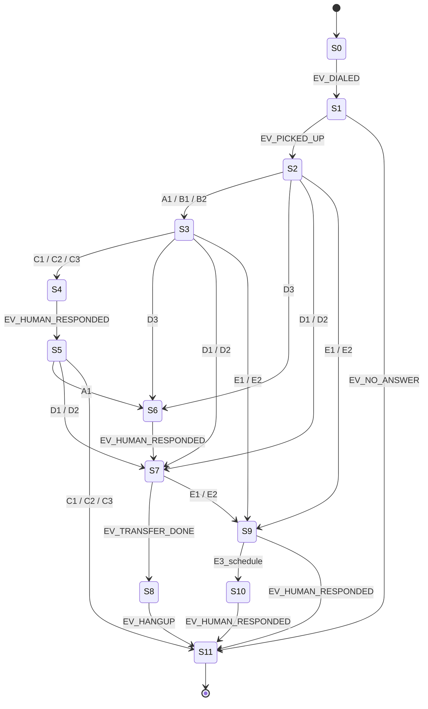

# State Machine 仕様書

| version | date | change |
| --- | --- | --- |
| 1.0 | 2026-05-04 | 初版（S0〜S11、遷移表、例外遷移、終了条件） |

> 参照: ID は [README.md §2](./README.md#2-共通-id-体系cross-reference-keys) を正本とする。
> 関連: 入力 intent の定義は [intent-improvement-spec.md](./intent-improvement-spec.md)、実装タスクは [implementation-backlog.md](./implementation-backlog.md)。

---

## 1. 目的とスコープ

- 受付突破プロセスを **状態遷移** に分解し、AI 自動架電と人力架電が同じルールで進行できるようにする
- 「どこで失敗したか」「どの遷移が成功率を上げたか」をログから機械的に取り出せるようにする
- 本仕様は **判定ルール（state × intent → next_state）** を提供する。intent の作り方は対象外（intent 仕様書の管轄）

> 用語: **遷移 (transition)** = ある state から別の state に移ること。`(current_state, input) → next_state` の三つ組で 1 行になる。

---

## 2. ステート一覧

[README.md §2.1](./README.md#21-state_idステートマシンの状態) と同期。種別は下記の運用上の意味。

| state_id | 名前 | 種別 | 概要 |
| --- | --- | --- | --- |
| `S0` | not_called | 初期 | リスト取得済み・未架電 |
| `S1` | dialing | 進行 | 発信中・呼出中 |
| `S2` | reception_contact | 進行 | 受付の応答を確認した直後 |
| `S3` | purpose_inquiry | 進行 | 用件確認に応答中（自分が話している） |
| `S4` | rejected | 失敗系 | 受付の拒否を確認した直後（切り返し前） |
| `S5` | rebuttal | 進行 | 切り返しトークを発話中 |
| `S6` | transfer_request | 進行 | 取次の意思を受付が示した（保留前） |
| `S7` | on_hold | 進行 | 保留中・取次処理中 |
| `S8` | keyperson_connected | 成功 | キーマンと接続完了（モジュールのゴール） |
| `S9` | absent | 保留 | 不在判明 |
| `S10` | callback_scheduled | 保留 | 再架電日時を確定 |
| `S11` | terminated | 終了 | 通話終了（成功・失敗・異常を問わない最終） |

---

## 3. 入力（遷移トリガー）

state machine への入力は 2 系統。両方とも **同じ遷移表** を引く。

### 3.1 intent 入力（AI モード／HUMAN モード共通の自動分類）

[README.md §2.2](./README.md#22-intent_id受付発話の意味ラベル) の `intent_id` がそのまま入力。発話単位（受付の 1 ターン）で 1 個の intent_id を取り出す。

### 3.2 外部イベント入力（intent では表現できない事象）

| event_id | 意味 | 主に発生する state |
| --- | --- | --- |
| `EV_DIALED` | 発信が回線に乗った | `S0 → S1` |
| `EV_PICKED_UP` | 相手が応答した | `S1 → S2` |
| `EV_NO_ANSWER` | 呼出後に応答なし（タイムアウト） | `S1 → S11` |
| `EV_HUMAN_RESPONDED` | 自分側の発話が完了した | `S3` 内、`S5` 内 |
| `EV_TRANSFER_DONE` | 取次完了（保留解除でキーマンの声） | `S7 → S8` |
| `EV_TIMEOUT` | 一定時間応答なし | 任意 |
| `EV_HANGUP` | 回線切断 | 任意 |

> 設計の意図: intent は「受付の意思」、event は「回線・タイマー・自分の発話完了」。両者を分けることで AI モードでも HUMAN モードでも同じ遷移表が使える。

---

## 4. 遷移表（正常系）

`(current_state, input) → next_state, response_template, side_effect` の三つ組。`response_template` の中身は本仕様の管轄外（[intent-improvement-spec.md §3](./intent-improvement-spec.md) のテンプレ ID を参照）。

### 4.1 進行系遷移

| current_state | input | next_state | response_template | side_effect |
| --- | --- | --- | --- | --- |
| `S0` | `EV_DIALED` | `S1` | — | log: dial_started |
| `S1` | `EV_PICKED_UP` | `S2` | — | start_recording |
| `S1` | `EV_NO_ANSWER` | `S11` | — | outcome=`OUT_NOISE` |
| `S2` | `A1_listening` | `S3` | `RT_ASK_TRANSFER_SHORT` | — |
| `S2` | `B1_simple_purpose` | `S3` | `RT_PURPOSE_SHORT` | — |
| `S2` | `B2_detailed_purpose` | `S3` | `RT_PURPOSE_DETAILED` | — |
| `S2` | `D1_hold` | `S7` | `RT_THANKS_QUIET` | — |
| `S2` | `D2_internal_check` | `S7` | `RT_THANKS_QUIET` | — |
| `S2` | `D3_name_request` | `S6` | `RT_NAME_AND_PURPOSE` | — |
| `S3` | `EV_HUMAN_RESPONDED` | `S2` | — | wait_for_reception_reply |
| `S3` | `C1_hard_reject` | `S4` | — | — |
| `S3` | `C2_soft_reject` | `S4` | — | — |
| `S3` | `C3_policy_block` | `S4` | — | — |
| `S3` | `D1_hold` | `S7` | `RT_THANKS_QUIET` | — |
| `S3` | `D2_internal_check` | `S7` | `RT_THANKS_QUIET` | — |
| `S3` | `D3_name_request` | `S6` | `RT_NAME_AND_PURPOSE` | — |
| `S4` | `EV_HUMAN_RESPONDED` | `S5` | `RT_REBUTTAL_BY_C_TYPE` | — |
| `S5` | `A1_listening` | `S6` | `RT_THANKS_AND_TRANSFER` | — |
| `S5` | `D1_hold` | `S7` | `RT_THANKS_QUIET` | — |
| `S5` | `D2_internal_check` | `S7` | `RT_THANKS_QUIET` | — |
| `S5` | `D3_name_request` | `S6` | `RT_NAME_AND_PURPOSE` | — |
| `S6` | `EV_HUMAN_RESPONDED` | `S7` | — | — |
| `S7` | `EV_TRANSFER_DONE` | `S8` | — | outcome=`OUT_CONNECTED` |
| `S7` | `E1_absent` | `S9` | — | — |
| `S7` | `E2_busy` | `S9` | — | — |

### 4.2 不在・再架電系遷移

| current_state | input | next_state | response_template | side_effect |
| --- | --- | --- | --- | --- |
| `S2` | `E1_absent` | `S9` | `RT_ASK_CALLBACK_SLOT` | — |
| `S2` | `E2_busy` | `S9` | `RT_ASK_CALLBACK_SLOT` | — |
| `S3` | `E1_absent` | `S9` | `RT_ASK_CALLBACK_SLOT` | — |
| `S3` | `E2_busy` | `S9` | `RT_ASK_CALLBACK_SLOT` | — |
| `S9` | `E3_schedule` | `S10` | `RT_CONFIRM_SCHEDULE` | record callback_at |
| `S9` | `EV_HUMAN_RESPONDED` | `S11` | — | outcome=`OUT_ABSENT` |
| `S10` | `EV_HUMAN_RESPONDED` | `S11` | — | outcome=`OUT_ABSENT`, schedule_callback |

### 4.3 終了系遷移

| current_state | input | next_state | response_template | side_effect |
| --- | --- | --- | --- | --- |
| `S5` | `C1_hard_reject` | `S11` | `RT_POLITE_CLOSE` | outcome=`OUT_REJECTED` |
| `S5` | `C2_soft_reject` | `S11` | `RT_POLITE_CLOSE` | outcome=`OUT_REJECTED` |
| `S5` | `C3_policy_block` | `S11` | `RT_POLITE_CLOSE` | outcome=`OUT_REJECTED` |
| `S8` | `EV_HANGUP` | `S11` | — | outcome=`OUT_CONNECTED` |
| 任意 | `EV_HANGUP` | `S11` | — | outcome は最後に判定 |

---

## 5. 例外遷移（ノイズ・タイムアウト）

`F1_unclear` `F2_silence` `F3_disconnect` と `EV_TIMEOUT` は **どの state でも** 起こりうるため、共通ルールで処理する。

### 5.1 共通例外ルール

| input | 動作 |
| --- | --- |
| `F1_unclear` | 同じ state に **留まる**（next_state = current_state）。再発話テンプレ `RT_RETRY_PROMPT` を返し、`unclear_count++`。3 回連続で `S11`（outcome=`OUT_NOISE`） |
| `F2_silence` | 同じ state に留まる。`silence_ms` を加算。累計 8 秒で `S11`（outcome=`OUT_NOISE`） |
| `F3_disconnect` | 即 `S11`（outcome=`OUT_NOISE`） |
| `EV_TIMEOUT` | state ごとの timeout（下表）を超えたら `S11`（outcome=`OUT_NOISE`） |

### 5.2 state ごとの timeout（推奨初期値）

| state_id | timeout (sec) | 補足 |
| --- | --- | --- |
| `S1` | 30 | コール音タイムアウト |
| `S2` | 12 | 受付応答待ち |
| `S3` | 15 | 自分の発話 + 受付の反応 |
| `S5` | 12 | 切り返し後の反応 |
| `S6` | 10 | 取次依頼の反応 |
| `S7` | 60 | 保留中の最大待機 |
| `S9` | 20 | 折返し時間ヒアリング |

> timeout は実運用ログで再調整する前提。初期値は仕様で固定し、設定ファイルから上書き可能にする。

---

## 6. 終了条件と outcome

`S11` への遷移時に `outcome_id` を確定させる。`outcome_id` は [README.md §2.3](./README.md#23-outcome_id通話セッションの最終結果) を参照。

判定ルール:

1. `S8` を経由して `S11` に到達 → `OUT_CONNECTED`
2. `S5` から `C*_*` で `S11` に到達 → `OUT_REJECTED`
3. `S9` または `S10` から `S11` → `OUT_ABSENT`
4. それ以外（`F3`、`EV_TIMEOUT`、`unclear_count >= 3`、`silence_ms >= 8000`） → `OUT_NOISE`

### 6.1 outcome 確定時の必須サイドエフェクト

| outcome | 必須処理 |
| --- | --- |
| `OUT_CONNECTED` | キーマン接続フラグ立て、HUMAN への handoff 通知 |
| `OUT_REJECTED` | rejection_reason（最後の C 系 intent_id）を保存 |
| `OUT_ABSENT` | callback_at（再架電希望日時）を保存。なければ翌営業日 10:00 |
| `OUT_NOISE` | 失敗箇所（最後の state_id, last_input）を保存 |

---

## 7. ログ要件（state_transitions テーブル）

すべての遷移は 1 行ログを残す。改善ループ（[intent-improvement-spec.md §6](./intent-improvement-spec.md)）の入力。

| 列 | 型 | 必須 | 説明 |
| --- | --- | --- | --- |
| `id` | text | yes | UUID |
| `session_id` | text | yes | call_sessions.id への外部キー |
| `seq` | int | yes | セッション内の連番 |
| `from_state` | text | yes | state_id |
| `to_state` | text | yes | state_id |
| `input_kind` | text | yes | `intent` or `event` |
| `input_id` | text | yes | intent_id または event_id |
| `response_template_id` | text | no | テンプレ ID（応答した場合） |
| `at` | datetime | yes | 遷移時刻 |
| `mode` | text | yes | `AI` or `HUMAN` |
| `extra_json` | text | no | unclear_count, silence_ms 等の補助情報 |

---

## 8. 不変条件（実装時に必ず守る）

1. 遷移表に **存在しない (state, input) ペアは禁止** — 未定義の組み合わせが発生したら `F1_unclear` として扱い、ログに `WARN: undefined_transition` を残す
2. AI モードと HUMAN モードで **同じ遷移表** を使う — `mode` 列はログ用であって分岐条件ではない
3. `S11` から他 state へは **戻らない** — 再架電は新しい session を作る（`S0` で別セッション）
4. side_effect の DB 書き込みは **遷移成功時のみ** — 例外発生時は遷移をロールバックする
5. timeout は state 入場時にタイマー始動・遷移時にリセット

---

## 9. 参考フロー図

正常系の幹は下記 1 本。`F*` `EV_TIMEOUT` `EV_HANGUP` はどこからでも `S11` に行きうる（図では省略）。

