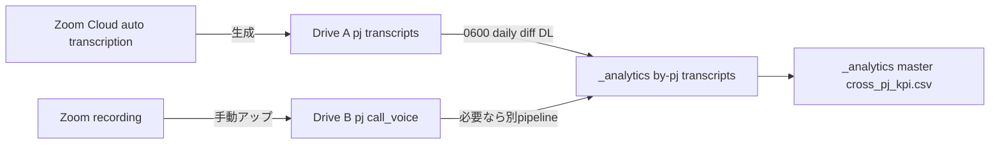

# 音声パイプライン: Zoom 自動文字起こし → `_analytics/`

PJ ごとの **音声**は重いので Drive 側に置き、**ローカル `_analytics/` には文字起こし（軽量テキスト）と派生指標だけ**を置きます。  
取り込み元は **Zoom の自動文字起こし**を一次採用、二次手段として **毎朝 06:00 の差分巡回**で取りこぼしを救います。

## 1. 全体像



- **正本（音源）**: Drive B `PJ_asset_Data/<year>/<pj_slug>/call_voice/` … 重いので Drive で完結
- **正本（文字起こし）**: Drive A `project_hangarr/<year>/<pj_slug>/transcripts/` … Zoom の自動文字起こし出力先
- **派生（ローカル）**: `_analytics/by-pj/<year>/<pj_slug>/transcripts/*.md` … frontmatter 付き MD で AI/集計用

## 2. 取り込みポリシー

### 2.1 一次: Zoom 自動文字起こしをそのまま使う

Zoom Cloud は会議終了後の数分〜十数分で自動文字起こし（`.vtt` / 文字起こしテキスト）を生成します。これを **Drive A の `transcripts/` に保存**しておけば、ローカルからは Drive 同期経由で見えます。

- **保存先**: `project_hangarr/<year>/<pj_slug>/transcripts/<yyyymmdd>_<short>.vtt`（または `.txt`）
- **責務**: 「Zoom → Drive A への落とし方」は本ドキュメントの管轄外（Zoom 側の運用 or 手動アップ）。本パイプラインは **Drive A に置かれていれば拾う**。

### 2.2 二次: 毎朝 06:00 の差分巡回（取りこぼし救済）

Zoom 起因で遅延・失敗した日に備え、**毎朝 06:00** に Drive A 配下の `transcripts/` を走査し、**ローカル `_analytics/` に未取り込みのもの**だけ MD 化します。

- 実行: Windows Task Scheduler から WSL 経由で `bash scripts/fetch_zoom_transcripts.py` を叩く
- 同期方向: **Drive A → ローカル `_analytics/` の片方向のみ**（Drive 側を書き換えない）
- 冪等性: 同じファイルを何度走らせても結果は同じ（ハッシュ or 修正時刻ベースで差分判定）

### 2.3 取り込みの単位

1 ファイル `.vtt`（または Zoom テキスト）→ 1 つの MD にする。命名は `_analytics/_analytics-spec.md` に従う:

```
_analytics/by-pj/<year>/<pj_slug>/transcripts/<yyyymmdd>_<short>.md
```

frontmatter は最低限これを埋める（詳細は [`_analytics-spec.md`](./_analytics-spec.md)）。

```markdown
---
type: transcript
pj_slug: PJname_yyyymmdd
date: 2026-04-15
period: 2026-04
source_path: project_hangarr/2026/PJname_20260415/transcripts/20260415_lead_call_001.vtt
duration_sec: 320
created: 2026-05-04
tags: []
---
# 本文（Zoom文字起こしを整形して貼る）
```

## 3. 失敗時の再試行と冪等性

| 失敗の種類 | 検知方法 | 動作 |
|-----------|----------|------|
| Drive 同期未完了で `.vtt` が読めない | サイズ 0 / 不完全 | スキップして翌朝再試行（手動再実行も可） |
| 既に取り込み済みのファイル | 既存 MD のヘッダ `source_path` 一致 | 上書きしない（**冪等**） |
| 文字起こしの後追い修正（Zoom 側更新） | `source_path` のファイル mtime > MD `created` | 既存 MD を **上書き再生成**（本文が手書きなら別ファイルに退避） |
| ネット/認証エラー | 例外ログ | `_analytics/manifest/voice_errors.log` に追記、Task Scheduler の次回起動で再試行 |

**前提**: Drive A はリポジトリ直下の `project_hangarr` シンボリックリンク経由で WSL から読める（`scripts/setup_project_hangarr_symlink.sh` 済み）。

## 4. 06:00 巡回の実装イメージ（雛形）

別フェーズで `scripts/fetch_zoom_transcripts.py` を追加します。本ドキュメントは仕様だけ。期待動作:

- 入力: `project_hangarr/<year>/<pj_slug>/transcripts/*.vtt`（or `.txt`）
- 出力: `_analytics/by-pj/<year>/<pj_slug>/transcripts/<yyyymmdd>_<short>.md`
- 引数: `--since YYYY-MM-DD`（指定なしは前回 manifest から差分）
- ログ: `_analytics/manifest/voice_errors.log` と `_analytics/manifest/voice_runs.log`

### 4.1 Windows Task Scheduler の設定例

- Trigger: 毎日 06:00（1 日 1 回）
- Action Program: `C:\Windows\System32\wsl.exe`
- Action Arguments:
  ```text
  -d Ubuntu --cd /home/mg_ogawa/DevelopmentRoom/salse_consulting bash -lc "source .venv/bin/activate && python scripts/fetch_zoom_transcripts.py"
  ```

## 5. 個人情報・秘密情報の扱い

- **生音声を `_analytics/` に置かない**。常に Drive B `call_voice/` に留める。
- 文字起こし MD には **顧客の個人情報がそのまま含まれ得る**ため、`_analytics/` は **`.gitignore` で必ず除外**する。
- 共有が必要な場合は要約版を `_analytics/master/insights/*.md` に作る（個人特定可能な情報は省く）。

## 6. 関連

- [re-design-2026-05.md](./re-design-2026-05.md) — RE 設計書（全体）
- [_analytics-spec.md](./_analytics-spec.md) — `metrics.json` と MD frontmatter のスキーマ
- [storage-coexistence.md](./storage-coexistence.md) — Drive 3 本と `_analytics/` の二重保管回避ルール
- [drive-data-hub.md](./drive-data-hub.md) — Drive A/B/C の Folder ID と同期コマンド
